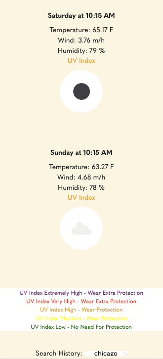

# Weather Dashboard
Weather dashboard to know when to got outside, and when not!

# Objectives
- To create a weather dashboard that when user inputs a city it:
    - Searches for the city

    - Displays the city searched for and presents current and future (5 day forecast) conditions that include:
        - Date, temperature, humidity, wind, UV index and weather conditions as an icon.

    - UV index is presented with a color to indicate if conditios are favorable, moderete or severe. 

    - City searched is added to the history and when user clicks on past searched it displays the data for the city.

# Website Images
Desktop View

Mobile View

# Links
Github Link:

Deployed Website Link: 
